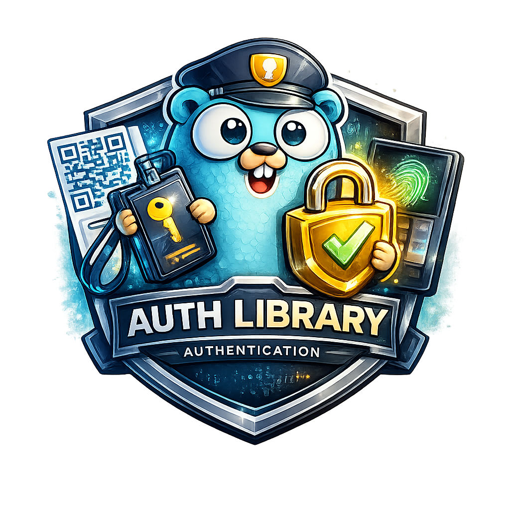

<div align="center">
  
  <h1>Attestor</h1>
  <p><em>Latin: "one who certifies" — pluggable authentication & identity propagation for Go</em></p>
</div>

[](https://github.com/abhipray-cpu/auth/actions/workflows/ci.yml)
[](https://pkg.go.dev/github.com/abhipray-cpu/auth)
[](https://goreportcard.com/report/github.com/abhipray-cpu/auth)
[](https://codecov.io/gh/abhipray-cpu/auth)

[](LICENSE)

A pluggable authentication library for Go. Handle credential verification, session management, identity propagation, and protocol bindings (HTTP middleware, gRPC interceptors) — your business logic reads `auth.GetIdentity(ctx)` and never imports auth internals.

## Features

| Feature | Description |
|---|---|
| **Multi-mode auth** | Password, OAuth2/OIDC, magic link, API key, mTLS/SPIFFE — all behind a single `AuthMode` interface |
| **Session management** | Redis and Postgres adapters included; idle + absolute timeouts, concurrent session limits, schema versioning |
| **Identity propagation** | SignedJWT (Ed25519, 30 s TTL, auto-rotation), session-based, SPIFFE — user identity travels between services |
| **HTTP middleware** | `RequireAuth` / `OptionalAuth` middleware, route registration, JWKS endpoint |
| **gRPC interceptors** | Unary + streaming server/client interceptors with mTLS peer identity |
| **Lifecycle hooks** | Before/after hooks for login, registration, logout, password reset, magic link — extend without modifying auth code |
| **Password policy** | NIST 800-63B defaults, breached password check (HaveIBeenPwned k-anonymity), custom validators |
| **Argon2id hashing** | OWASP-recommended parameters out of the box |
| **Pen tested** | 80 pen test cases across 12 security categories — zero critical/high findings |

## Quick Start (5 minutes)

### Install

```bash
go get github.com/abhipray-cpu/auth
```

### Minimal HTTP Server with Password Login

```go
package main

import (
    "context"
    "log"
    "net/http"
    "strings"

    "github.com/abhipray-cpu/auth"
    "github.com/abhipray-cpu/auth/authsetup"
    authhttp "github.com/abhipray-cpu/auth/http"
    goredis "github.com/redis/go-redis/v9"
)

// 1. Implement UserStore for your database.
type userStore struct{ /* your DB */ }

func (s *userStore) FindByIdentifier(_ context.Context, id string) (auth.User, error) {
    // Look up user by email in your DB
    return nil, auth.ErrUserNotFound
}
func (s *userStore) Create(_ context.Context, u auth.User) error        { return nil }
func (s *userStore) UpdatePassword(_ context.Context, _, _ string) error { return nil }
func (s *userStore) IncrementFailedAttempts(_ context.Context, _ string) error { return nil }
func (s *userStore) ResetFailedAttempts(_ context.Context, _ string) error     { return nil }
func (s *userStore) SetLocked(_ context.Context, _ string, _ bool) error       { return nil }

func main() {
    rdb := goredis.NewClient(&goredis.Options{Addr: "localhost:6379"})

    // 2. Wire up the Attestor.
    a, err := authsetup.New(
        authsetup.WithUserStore(&userStore{}),
        authsetup.WithIdentifierConfig(auth.IdentifierConfig{
            Field:     "email",
            Normalize: strings.ToLower,
        }),
        authsetup.WithSessionRedis(rdb, ""),
    )
    if err != nil {
        log.Fatal(err)
    }
    defer a.Close()

    // 3. Register routes and middleware.
    mux := http.NewServeMux()
    handlers := authhttp.NewHandlers(a.Engine, authhttp.DefaultCookieConfig())
    authhttp.RegisterRoutes(mux, handlers, authhttp.DefaultRouteConfig())

    middleware := authhttp.NewMiddleware(a.Engine, authhttp.DefaultCookieConfig())

    // 4. Protect your routes.
    mux.Handle("/api/", middleware.RequireAuth(http.HandlerFunc(func(w http.ResponseWriter, r *http.Request) {
        identity := auth.GetIdentity(r.Context())
        w.Write([]byte("Hello, " + identity.SubjectID))
    })))

    log.Println("listening on :8080")
    log.Fatal(http.ListenAndServe(":8080", mux))
}
```

This gives you:

- `POST /auth/register` — register with email + password
- `POST /auth/login` — login, get session cookie
- `POST /auth/logout` — destroy session
- `GET /api/*` — protected routes with `auth.GetIdentity(ctx)`

## Architecture

```
┌─────────────────────────────────────────────────────────────────┐
│                     Your Application                            │
│  identity := auth.GetIdentity(ctx)  // ← the only contract     │
├─────────────────────────────────────────────────────────────────┤
│  HTTP Middleware          │  gRPC Interceptors                   │
│  RequireAuth / Optional   │  Unary / Streaming / Client          │
├─────────────────────────────────────────────────────────────────┤
│                        Engine                                    │
│  Register / Login / Verify / Logout / ChangePassword             │
├──────┬──────┬──────┬──────┬──────┬───────────────────────────────┤
│ Pass │OAuth │Magic │ API  │ mTLS │  Auth Modes (pluggable)       │
│ word │ OIDC │ Link │ Key  │SPIFFE│                               │
├──────┴──────┴──────┴──────┴──────┴───────────────────────────────┤
│  Session Manager     │  Hooks Manager     │  Identity Propagator │
│  Redis / Postgres    │  Before / After     │  SignedJWT / SPIFFE  │
├──────────────────────┴────────────────────┴──────────────────────┤
│  Team-provided interfaces: UserStore, Authorizer, Notifier       │
└──────────────────────────────────────────────────────────────────┘
```

## Documentation

| Document | Description |
|---|---|
| [Usage Guide](docs/usage.md) | Everything: install, all auth modes, sessions, HTTP/gRPC, hooks, propagation, API keys, password policy, errors, FAQ, migration |
| [Architecture](docs/architecture.md) | Internal design, package structure, data flow |

## Security

See [SECURITY.md](SECURITY.md) for the security model, vulnerability reporting, and pen test results.

**Key guarantees:**
- Constant-time credential verification (prevents timing-based user enumeration)
- Generic error messages on auth failure (no user/password distinction)
- Session IDs: 32 bytes entropy, SHA-256 hashed at rest, idle + absolute timeouts
- Argon2id with OWASP parameters (19 MiB memory, 2 iterations, 1 thread)
- Ed25519-signed propagation JWTs with 30 s TTL and automatic key rotation
- Pen tested: 80 test cases, zero critical/high findings

## Examples

See the [`examples/`](examples/) directory:

| Example | Description |
|---|---|
| [`http-password`](examples/http-password/) | Minimal HTTP with password login (~50 lines) |
| [`http-oauth`](examples/http-oauth/) | HTTP with Google + Okta OAuth |
| [`http-magic-link`](examples/http-magic-link/) | Magic link with Notifier implementation |
| [`http-api-key`](examples/http-api-key/) | API key auth with APIKeyStore implementation |
| [`grpc-mtls`](examples/grpc-mtls/) | gRPC with mTLS workload identity |
| [`grpc-propagation`](examples/grpc-propagation/) | Two gRPC services with SignedJWTPropagator |
| [`full-stack`](examples/full-stack/) | HTTP gateway + 2 gRPC services, all modes |
| [`custom-session-store`](examples/custom-session-store/) | Custom SessionStore implementation |
| [`hooks-onboarding`](examples/hooks-onboarding/) | AfterRegister hook for onboarding |

## Contributing

See [CONTRIBUTING.md](CONTRIBUTING.md) for development setup, testing, and submission guidelines.

## License

Apache 2.0 — see [LICENSE](LICENSE).
