# Attestor — Architecture

> **Version:** 1.0 · **Date:** 2026-02-17

---

## Table of Contents

1. [Scope — What We Own, What We Don't](#1-scope--what-we-own-what-we-dont)
2. [Architecture Diagrams](#2-architecture-diagrams)
   - 2.1 [System Context](#21-system-context)
   - 2.2 [Inside the Go Process](#22-inside-the-go-process)
   - 2.3 [Auth Engine Internals](#23-auth-engine-internals)
   - 2.4 [Responsibility Boundary](#24-responsibility-boundary)
3. [Authentication Modes](#3-authentication-modes)
   - 3.1 [Enterprise IdP Support](#31-enterprise-idp-support)
4. [Session Management — Library Owned](#4-session-management--library-owned)
5. [Identity Propagation — Cross-Service](#5-identity-propagation--cross-service)
6. [Password Policy](#6-password-policy)
7. [Interceptor Model](#7-interceptor-model)
8. [Interface Contracts](#8-interface-contracts)
9. [C4 Level 4 — Code Diagrams (UML)](#9-c4-level-4--code-diagrams-uml)
   - 9.1 [Session Store — Interfaces and Adapters](#91-session-store--interfaces-and-adapters)
   - 9.2 [User Store, Authorizer, Notifier, Hasher — Interfaces and Types](#92-user-store-authorizer-notifier-hasher--interfaces-and-types)
   - 9.3 [API Key Store and Password Policy](#93-api-key-store-and-password-policy)
   - 9.4 [Identity Propagator — Interfaces and Implementations](#94-identity-propagator--interfaces-and-implementations)
   - 9.5 [Auth Engine, Modes, and Protocol Bindings](#95-auth-engine-modes-and-protocol-bindings)
10. [Sequence Diagrams](#10-sequence-diagrams)
    - 10.1 [HTTP Request — Session Validation](#101-http-request--session-validation)
    - 10.2 [Password Login — With Security Protections](#102-password-login--with-security-protections)
    - 10.3 [OAuth2 / OIDC Login — With Auto-Registration](#103-oauth2--oidc-login--with-auto-registration)
    - 10.4 [Magic Link — Passwordless Login](#104-magic-link--passwordless-login)
    - 10.5 [User Registration — With Onboarding](#105-user-registration--with-onboarding)
    - 10.6 [Cross-Protocol — HTTP to gRPC Identity Propagation](#106-cross-protocol--http-to-grpc-identity-propagation)
    - 10.7 [System-to-System — Machine Identity Only](#107-system-to-system--machine-identity-only)
11. [Identity Context](#11-identity-context)
12. [Integration Summary](#12-integration-summary)
13. [Design Rationale](#13-design-rationale)

---

## Color Scheme Legend

All diagrams in this document follow a consistent color scheme:

| Color | Meaning |
|---|---|
| **Blue** (`#dbeafe` / `#2563eb`) | Attestor owned — we ship and maintain this |
| **Amber** (`#fef3c7` / `#d97706`) | Team-provided — team must implement or configure |
| **Green** (`#d1fae5` / `#059669`) | Identity context — the output of auth, flows into your code |
| **Gray** (`#f3f4f6` / `#9ca3af`) | Optional — team can skip entirely |
| **Light gray** (`#f9fafb` / `#d1d5db`) | External systems — outside our boundary |

Solid arrows = we call directly or we own. Dotted arrows = team-provided interface or optional.

---

## 1. Scope — What We Own, What We Don't

### We Own

| Area | Description |
|---|---|
| **Credential verification** | Passwords (via Hasher), OAuth2/OIDC token verification, magic link tokens, API key validation, mTLS cert verification, SPIFFE SVIDs |
| **Authentication modes** | Password, OAuth2/OIDC, Magic Link, API Key, mTLS/SPIFFE — pluggable via `AuthMode` interface |
| **Session management** | We own the session schema, lifecycle, and ship Redis + Postgres adapters. Team provides the infrastructure (Redis/Postgres instance). Session fixation prevention is a non-configurable security invariant. |
| **Identity normalization** | Any verified credential produces a canonical `Identity` value for `context.Context` |
| **Identity propagation** | `IdentityPropagator` interface with three shipped implementations (`SignedJWTPropagator`, `SessionPropagator`, `SPIFFEPropagator`). Controls how user identity travels between services. |
| **Protocol bindings** | HTTP middleware, gRPC interceptors (unary + stream, client + server), S2S credential exchange |
| **Password policy** | Configurable `PasswordPolicy` struct with NIST 800-63B defaults. Validated during registration and password change. |
| **Magic link token storage** | Uses the same session store infrastructure (same Redis/Postgres instance) with a separate key prefix / table. An optional `MagicLinkStore` interface is exposed via `WithMagicLinkStore()` for teams that need custom storage. Tokens are short-lived and single-use. |
| **Lifecycle hooks** | Before/After events on login, register, logout, MFA. Teams register typed callbacks. |
| **User onboarding** | Register-and-login-in-one-step. OAuth auto-registration on first login. Seamless experience. |
| **Session schema versioning** | Schema version tracked in the sessions table. Library checks version on startup and fails with a clear error + migration guide link if outdated. Never auto-migrates. |

### We Define (Interfaces — Team Implements)

| Interface | Required? | Description |
|---|---|---|
| **UserStore** | Yes | CRUD for users. Team owns the schema and database. |
| **User** | Yes | Wraps team's user model so the library can read subject ID, password hash, lock status. |
| **IdentifierConfig** | Yes | Team tells us what identifies a user: email, username, phone, UUID. We never assume. |
| **APIKeyStore** | If API Key mode enabled | Key lookup, creation, revocation. Separate from `UserStore` — API keys are a first-class concept with their own metadata (name, scopes, expiry, last used). |
| **Authorizer** | If AuthZ needed | `CanAccess(ctx, subject, action, resource) → bool`. Team implements with Casbin, OPA, Cedar, or custom. |
| **Notifier** | Optional | Team implements if they want notifications on auth events. If not configured, silently skipped. Required only if magic link mode is enabled. |
| **Hasher** | No (default provided) | Argon2id shipped as default. Override only for legacy schemes. |
| **SessionStore** | No (adapters shipped) | Redis + Postgres adapters shipped. Custom adapter only if neither fits. |

### Not Our Concern

| Area | Why |
|---|---|
| **Rate limiting** | Infrastructure concern. Use your API gateway, reverse proxy, or a dedicated library. Mixing rate limiting into an auth library creates configuration conflicts with API gateways. |
| **User storage / schema** | Team's database, team's migrations, team's schema. We ask for an interface. |
| **External token issuance** | We do NOT issue tokens for team APIs or end users. We verify credentials and manage sessions. The `SignedJWTPropagator` creates 30-second internal assertions for cross-service identity — this is infrastructure plumbing, not token issuance. |
| **Notifications** | Optional interface. If the team wants emails/SMS on auth events, they implement `Notifier`. We emit events; they decide delivery. |
| **Authorization decisions** | We produce an identity. What it's allowed to do is the team's domain. |
| **User identifier choice** | Email, username, phone, UUID, employee ID — the team configures this. |
| **SAML** | SAML is a legacy protocol. Every enterprise IdP that speaks SAML also speaks OIDC. For the rare SAML-only case, use a SAML-to-OIDC bridge (Dex, Keycloak). Supporting SAML would triple our protocol surface for <5% of use cases. |
| **CSRF protection** | Framework-level concern. |
| **Infrastructure** | Databases, Kubernetes, TLS certificate issuance, secret management — all team-owned. |

---

## 2. Architecture Diagrams

### 2.1 System Context

Where the Attestor sits in the broader ecosystem.

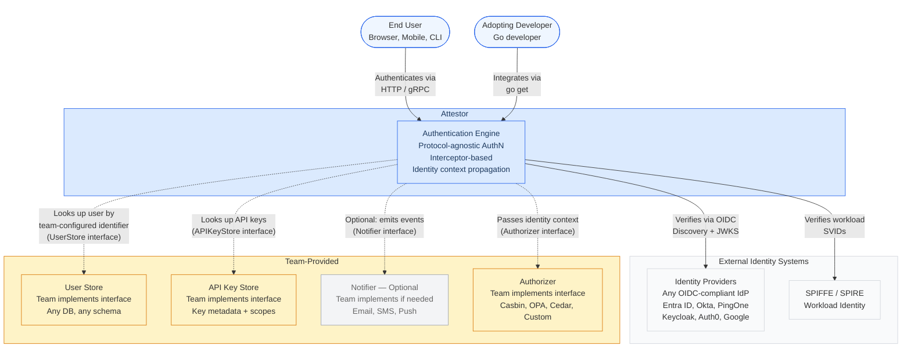

**Reading the diagram:**
- **Blue** = we own and ship it.
- **Amber** = team must provide an implementation.
- **Gray** (Notifier) = entirely optional.
- **Solid arrows** = direct calls we make (IdP verification, SPIFFE).
- **Dotted arrows** = team-provided interface implementations.

---

### 2.2 Inside the Go Process

How library components interact within a running application. Shows authentication modes, session management, identity propagation, and the flow to business logic.

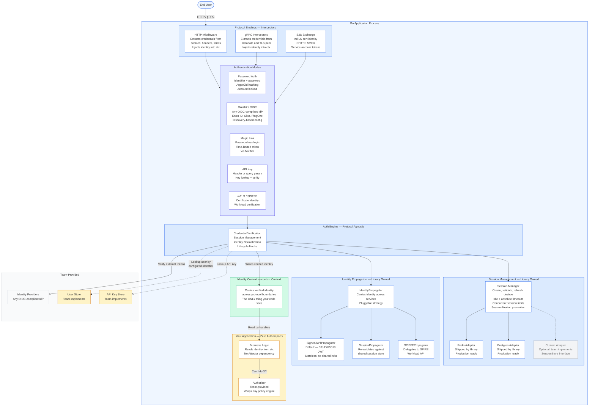

**Key observations:**
- **Authentication Modes** are pluggable. The engine dispatches to the correct mode based on credential type.
- **Session Management** is entirely library-owned. We ship the schema and two production-ready adapters (Redis, Postgres). The team provides the infrastructure (a Redis or Postgres instance). A custom adapter is optional.
- **Identity Propagation** is library-owned with three strategy implementations. `SignedJWTPropagator` is the default.
- **API Key Mode** uses the `APIKeyStore` interface, separate from `UserStore`. API keys have their own metadata (scopes, expiry, last used).
- The **Custom Adapter** is grayed out — it exists only if Redis and Postgres don't fit the team's needs.

---

### 2.3 Auth Engine Internals

What's inside the auth engine. Session management and identity propagation are highlighted as library-owned.

```mermaid
flowchart TB
    subgraph engine ["Auth Engine — Components"]
        direction TB

        subgraph verify ["Credential Verification"]
            credVerifier["Credential Verifier<br/>Dispatches to correct auth mode<br/>Password, OAuth2, Magic Link<br/>API Key, mTLS, SPIFFE"]
        end

        subgraph session ["Session Management — Library Owned"]
            direction LR
            sessionMgr["Session Manager<br/>Create, validate, refresh, destroy<br/>Idle + absolute timeouts<br/>Concurrent session limits<br/>Session fixation prevention<br/>Schema versioning"]
        end

        subgraph prop ["Identity Propagation — Library Owned"]
            direction LR
            propagator["Identity Propagator<br/>Encode/Decode identity<br/>for cross-service calls<br/>SignedJWT default"]
        end

        subgraph output ["Identity Output"]
            direction LR
            identityNorm["Identity Normalizer<br/>Any credential source into<br/>canonical Identity struct<br/>for context propagation"]
            hookEmitter["Hook Emitter<br/>Before/After lifecycle events<br/>Login, logout, register, MFA<br/>Optional typed callbacks"]
        end

        credVerifier --> identityNorm
        sessionMgr --> identityNorm
        propagator --> identityNorm
        hookEmitter -. "fires on<br/>auth events" .-> credVerifier
    end

    subgraph sessionAdapters ["Session Store Adapters"]
        direction LR
        redis["Redis Adapter<br/>Library ships this<br/>Production ready"]
        postgres["Postgres Adapter<br/>Library ships this<br/>Production ready"]
        custom["Custom Adapter<br/>Optional: team implements<br/>SessionStore interface"]
    end

    subgraph interfaces ["Team-Provided via Interfaces"]
        direction LR
        userStore["User Store<br/>Lookup by configured identifier"]
        apiKeyStore["API Key Store<br/>Key lookup + metadata"]
        hasher["Hasher<br/>Argon2id default provided"]
        notifier["Notifier — Optional<br/>Team enables if needed"]
    end

    sessionMgr --> redis
    sessionMgr --> postgres
    sessionMgr -.-> custom

    credVerifier -. "lookup user" .-> userStore
    credVerifier -. "lookup API key" .-> apiKeyStore
    credVerifier -- "hash/verify" --> hasher
    hookEmitter -. "optional notify" .-> notifier

    style engine fill:#eff6ff,stroke:#2563eb,color:#333
    style verify fill:#dbeafe,stroke:#2563eb,color:#333
    style session fill:#dbeafe,stroke:#2563eb,color:#333
    style prop fill:#dbeafe,stroke:#2563eb,color:#333
    style output fill:#d1fae5,stroke:#059669,color:#333
    style sessionAdapters fill:#dbeafe,stroke:#2563eb,color:#333
    style interfaces fill:#fef3c7,stroke:#d97706,color:#333

    style credVerifier fill:#fff,stroke:#2563eb,color:#333
    style sessionMgr fill:#fff,stroke:#2563eb,color:#333
    style propagator fill:#fff,stroke:#2563eb,color:#333
    style identityNorm fill:#fff,stroke:#059669,color:#333
    style hookEmitter fill:#fff,stroke:#059669,color:#333
    style redis fill:#fff,stroke:#2563eb,color:#333
    style postgres fill:#fff,stroke:#2563eb,color:#333
    style custom fill:#f3f4f6,stroke:#9ca3af,color:#666
    style userStore fill:#fef3c7,stroke:#d97706,color:#333
    style apiKeyStore fill:#fef3c7,stroke:#d97706,color:#333
    style hasher fill:#fef3c7,stroke:#d97706,color:#333
    style notifier fill:#f3f4f6,stroke:#9ca3af,color:#666
```

---

### 2.4 Responsibility Boundary

The ownership boundary between Attestor and adopting team. Session management and identity propagation are on our side. Infrastructure and API key storage are on theirs.

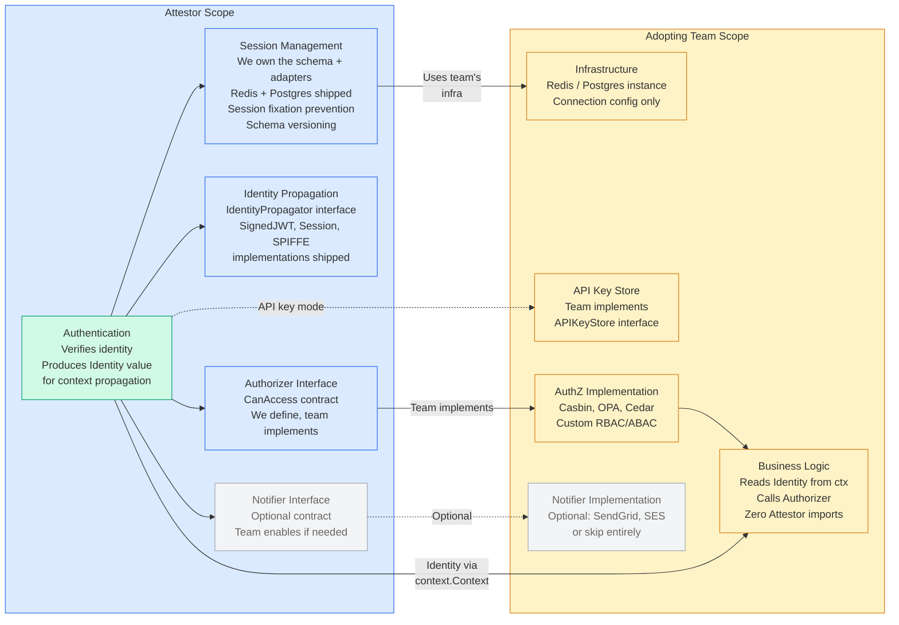

---

## 3. Authentication Modes

The auth engine supports multiple authentication modes. Each mode implements the same `AuthMode` interface. The engine dispatches to the correct mode based on the credential type in the request.

| Mode | Credential | How It Works | Requires |
|---|---|---|---|
| **Password** | Identifier + password | Lookup user by configured identifier, verify password hash via Hasher. Constant-time comparison for non-existent users. Account lockout after N failures. Password validated against `PasswordPolicy` on registration and change. | UserStore, Hasher |
| **OAuth2 / OIDC** | Authorization code | Redirect to provider → callback with code → exchange for id_token → verify signature + claims → produce identity. Auto-registers new users on first login. **PKCE enabled by default for all flows** (mandatory, not optional). **Works with any OIDC-compliant provider** — see [Enterprise IdP Support](#31-enterprise-idp-support). | UserStore, Provider config |
| **Magic Link** | One-time token via email/SMS | Generate short-lived token, deliver via Notifier, user clicks link, verify token, produce identity. Passwordless. Token stored using session store infrastructure (separate key prefix/table) — no additional interface required. | UserStore, Notifier (**required** for this mode) |
| **API Key** | Key in header or query param | Lookup key via `APIKeyStore`, verify it hasn't expired or been revoked, produce identity. For programmatic access. API keys are a first-class concept — separate from user records. | APIKeyStore |
| **mTLS / SPIFFE** | X.509 certificate or SVID | Verify peer certificate against trust anchors. Extract workload identity from cert CN or SPIFFE ID. For service-to-service. | Trust anchor config |

**All modes produce the same output:** an `Identity` value written to `context.Context`. Your business logic doesn't know or care which mode was used.

> **Design note — PKCE:** [PKCE (Proof Key for Code Exchange)](https://datatracker.ietf.org/doc/html/rfc7636) is mandatory for public clients (SPAs, mobile apps) and strongly recommended for all clients per the [OAuth 2.0 Security BCP](https://datatracker.ietf.org/doc/html/draft-ietf-oauth-security-topics). The library generates `code_verifier` + `code_challenge` automatically for every OAuth flow. This is a non-negotiable security requirement, not a configurable option.

### 3.1 Enterprise IdP Support

The OAuth2/OIDC mode is **provider-agnostic by design**. We program against the OIDC protocol, not individual providers. Any identity provider that implements the [OpenID Connect Discovery](https://openid.net/specs/openid-connect-discovery-1_0.html) specification (`/.well-known/openid-configuration`) works out of the box.

#### How It Works

Our `OAuthMode` uses **OIDC Discovery** at startup:

1. Team provides the **Issuer URL** (e.g., `https://login.microsoftonline.com/{tenant}/v2.0`)
2. Library fetches `{issuer}/.well-known/openid-configuration` automatically
3. From that document, we discover: authorization endpoint, token endpoint, JWKS URI, supported scopes, supported claims
4. JWKS (public signing keys) are cached and rotated automatically via the `jwks_uri`
5. All subsequent token verification uses the discovered endpoints and keys

This means **zero provider-specific code**. Adding a new IdP is a configuration change, not a code change.

#### Verified Compatible Providers

| Provider | Issuer URL Pattern | Notes |
|---|---|---|
| **Microsoft Entra ID** (Azure AD) | `https://login.microsoftonline.com/{tenant}/v2.0` | Supports `common`, `organizations`, `consumers`, or specific tenant. Multi-tenant apps supported. |
| **Okta** | `https://{domain}.okta.com/oauth2/{authServerId}` | Org authorization server or custom authorization server. |
| **Auth0** | `https://{domain}.auth0.com/` | Universal Login. Custom domains supported. |
| **PingFederate / PingOne** | `https://{host}/as` or `https://auth.pingone.{region}/` | Enterprise SSO and federation. |
| **Keycloak** | `https://{host}/realms/{realm}` | Open source. Common in on-premise deployments. |
| **AWS Cognito** | `https://cognito-idp.{region}.amazonaws.com/{poolId}` | User pools with hosted UI. |
| **Google Workspace** | `https://accounts.google.com` | Consumer + enterprise (Google Workspace). |
| **OneLogin** | `https://{domain}.onelogin.com/oidc/2` | Enterprise SSO. |
| **ForgeRock / PingIdentity** | `https://{host}/am/oauth2/{realm}` | AM server with OIDC support. |
| **Any OIDC-certified provider** | Provider's documented issuer URL | If it has `/.well-known/openid-configuration`, it works. |

#### What the Team Configures Per Provider

```go
authsetup.WithOAuthProvider(oauth.ProviderConfig{
    Name:         "entra-id",                                         // arbitrary name
    IssuerURL:    "https://login.microsoftonline.com/{tenant}/v2.0",  // we discover everything from this
    ClientID:     "from-env",                                         // team registers app with IdP
    ClientSecret: "from-env",                                         // team registers app with IdP
    Scopes:       []string{"openid", "profile", "email"},             // standard OIDC scopes
    RedirectURL:  "https://app.example.com/auth/oauth/entra-id/callback",
})
```

That's it. No provider-specific adapters. No "Okta plugin" or "Azure AD module". The OIDC spec handles the rest.

#### Multiple Providers Simultaneously

Teams can register multiple providers. The library routes to the correct one based on the OAuth initiation URL:

- `/auth/oauth/entra-id` → Microsoft Entra ID
- `/auth/oauth/okta` → Okta
- `/auth/oauth/google` → Google

Each provider has its own client credentials, scopes, and redirect URL. The engine handles state, nonce, PKCE, and token verification per-provider.

---

## 4. Session Management — Library Owned

Session management is too critical to leave to individual teams. A misconfigured session schema or a broken TTL policy is a security vulnerability. We own this.

### What We Own

| Concern | Details |
|---|---|
| **Session schema** | We define the session structure: ID, SubjectID, CreatedAt, ExpiresAt, LastActiveAt, SchemaVersion, Metadata |
| **Session lifecycle** | Create, validate, refresh, destroy. Idle timeout, absolute timeout, sliding window refresh. |
| **Session fixation prevention** | On every successful authentication (login, register, OAuth callback), the library destroys any existing session for the request and generates a completely new session ID. Pre-authentication session IDs are never reused. This is an invariant — not configurable. |
| **Concurrent session limits** | Configurable max sessions per subject. Oldest session evicted when limit is exceeded. |
| **Magic link token storage** | Magic link tokens are stored using the same session store infrastructure (same Redis/Postgres instance) with a separate key prefix (`magiclink:`) or table (`magic_link_tokens`). An optional `MagicLinkStore` interface is exposed via `WithMagicLinkStore()` for teams that need custom token storage. Tokens have a short TTL and are single-use. |
| **Schema versioning** | A `schema_version` field is stored in the sessions table. On startup, the library reads the schema version. If outdated, the library fails with a clear error message and a link to the migration guide. **The library never auto-migrates in production.** Migration SQL is shipped as files; the team runs them explicitly. |
| **Redis adapter** | Production-ready. Automatic TTL via Redis EXPIRE. Prefix-based key isolation. |
| **Postgres adapter** | Production-ready. Automatic cleanup of expired sessions. Index on SubjectID + ExpiresAt. |
| **Session config** | IdleTimeout, AbsoluteTimeout, MaxConcurrent, CookieName, CookieSecure, CookieSameSite |

### What the Team Provides

| Concern | Details |
|---|---|
| **Infrastructure** | A Redis or Postgres instance. Connection string / config. |
| **Custom adapter** | Optional. Only if Redis and Postgres don't fit. Implement the `SessionStore` interface. |
| **Migrations** | When upgrading the library, the team runs migration SQL we ship. Explicit, auditable, safe. |

### Security Guarantees

These are invariants — not configurable:

1. **Session fixation prevention.** Every authentication event (login, register, OAuth callback) destroys the old session and creates a new one. This is built into `SessionManager.CreateSession()`.
2. **Session IDs are hashed in storage.** The raw session ID is in the cookie; the stored version is a SHA-256 hash. Compromised storage doesn't leak valid session IDs.
3. **Timing-safe session lookup.** Session validation uses constant-time comparison to prevent timing attacks.

### Why We Don't Leave This to Teams

If we ship only an interface and let teams build the session store:
- They might forget `ExpiresAt` and sessions live forever.
- They might not index `SubjectID` and concurrent session checks become O(n) table scans.
- They might store session IDs in plain text instead of hashing them.
- They might not implement idle timeout, only absolute timeout.
- They might use client-side sessions (signed cookies) without understanding the revocation problem.
- They might miss session fixation prevention entirely.

By owning the session store adapters, we guarantee the schema is correct, timeouts work, session IDs are handled securely, and session fixation is prevented.

---

## 5. Identity Propagation — Cross-Service

When Service A calls Service B on behalf of a user, the user's identity must travel with the request. This is the hardest problem in multi-service authentication — if done wrong, any service can forge user identities.

### The Problem

A gRPC client interceptor forwards user identity from Service A to Service B. But:
- Who signs the identity claim?
- How does Service B verify it?
- Does this require shared infrastructure?

If the identity claim is unsigned, **any service can impersonate any user** by writing arbitrary metadata in gRPC calls.

### The Solution: `IdentityPropagator` Interface

We ship a **propagation strategy interface** with three built-in implementations. Teams pick based on their deployment topology.

```go
// IdentityPropagator controls how user identity travels between services.
// The library ships three implementations. Teams pick one (or build custom).
type IdentityPropagator interface {
    // Encode creates a portable identity claim from the current context.
    // Called by client interceptor before outbound gRPC call.
    Encode(ctx context.Context, identity Identity) (map[string]string, error)

    // Decode verifies and extracts identity from inbound gRPC metadata.
    // Called by server interceptor on incoming gRPC call.
    Decode(ctx context.Context, metadata map[string]string, peerIdentity *WorkloadIdentity) (Identity, error)
}
```

### Shipped Implementations

| Implementation | When to Use | Key Management | Verification | Revocation |
|---|---|---|---|---|
| **`SignedJWTPropagator`** (default) | Multi-cluster, multi-region, event-driven. No SPIFFE. Enterprise scale. | Library generates Ed25519 keypair. Public key served at `/.well-known/auth-keys` (JWKS format). Team configures trusted issuers. Auto-rotation with overlap period. | Standard JWT verification. 30-second expiry. Audience-restricted. | 30-second revocation gap (acceptable for most use cases). |
| **`SessionPropagator`** | Small deployments, shared infra, monolith-to-microservices migration. | None — uses existing session store. | Re-validates session ID against shared SessionStore. | Instant — delete session, all services lose access. |
| **`SPIFFEPropagator`** | Large enterprises with SPIFFE/SPIRE deployed. Highest security requirements. | Fully delegated to SPIRE. Zero key management by the library. | JWT-SVID verification via SPIFFE Workload API. Audience-restricted. | Depends on SVID TTL (typically minutes). |

### Decision Tree

```
Do your services share a session store (same Redis/Postgres)?
  ├── Yes → SessionPropagator (simplest, instant revocation)
  └── No
        ├── Do you have SPIFFE/SPIRE deployed?
        │     ├── Yes → SPIFFEPropagator (best-in-class zero-trust)
        │     └── No → SignedJWTPropagator (stateless, scales everywhere)
        └── Event-driven (Kafka, NATS)?
              └── SignedJWTPropagator (only stateless option works here)
```

**Default:** `SignedJWTPropagator` — it works everywhere, has no infrastructure assumptions, and key management is automated by the library. Teams that want simpler (shared session) or stronger (SPIFFE) can switch with one config line.

### SignedJWTPropagator — Key Details

The `SignedJWTPropagator` creates a **30-second internal assertion** (not an external-facing token) that carries user identity between services:

| Aspect | Detail |
|---|---|
| **Algorithm** | Ed25519 (EdDSA) |
| **TTL** | 30 seconds |
| **Claims** | `sub` (subject ID), `iss` (issuing service), `aud` (target service), `iat`, `exp`, `auth_method`, `auth_time` |
| **Key distribution** | Public key served at `/.well-known/auth-keys` in JWKS format. Verifying services configure trusted issuers. |
| **Key rotation** | Automatic. Overlap period = 2× JWT TTL (60 seconds). Old key accepted during overlap. |
| **Key bootstrapping** | Generated on first start. Persisted via session store infrastructure (or file / env var). |
| **Audience restriction** | Each JWT targets a specific service. Can't replay a JWT intended for Service B against Service C. |

> **On the "we don't issue tokens" principle:** The `SignedJWTPropagator` creates internal assertions that are infrastructure plumbing — the same way mTLS certs are infrastructure plumbing. These are not access tokens for team APIs. They are not exposed to end users. They have a 30-second lifespan and are audience-restricted. The principle "we don't issue tokens" means we don't issue tokens for team APIs or end users.

### Tradeoffs

| Concern | Detail |
|---|---|
| **Revocation gap** | A revoked session still has valid JWTs for up to 30 seconds (`SignedJWTPropagator`). For instant revocation requirements, use `SessionPropagator`. |
| **Clock skew** | Verify services must have reasonably synchronized clocks (NTP). The 30-second window accommodates typical skew. |
| **Custom propagation** | Teams can implement `IdentityPropagator` for anything we didn't anticipate (e.g., Vault transit engine, custom HSM signing). |

---

## 6. Password Policy

Password policy is a configurable struct, not an interface. We ship sane defaults based on [NIST 800-63B](https://pages.nist.gov/800-63-3/sp800-63b.html) and the team overrides as needed.

### Default Policy (NIST 800-63B)

| Rule | Default | Rationale |
|---|---|---|
| **Min length** | 8 characters | NIST 800-63B minimum |
| **Max length** | 128 characters | Prevents denial-of-service via hash computation on extremely long inputs |
| **Breached password check** | Enabled | k-anonymity check against known breached password lists (e.g., HaveIBeenPwned API). Only the first 5 characters of the SHA-1 hash are sent — the full password never leaves the library. |
| **Composition rules** (uppercase, digit, special) | Disabled | NIST 800-63B explicitly discourages composition rules. They reduce usable password space and lead to predictable patterns ("Password1!"). |
| **Custom validator** | nil | Teams can add domain-specific rules (e.g., "password must not contain company name") via a `func(string) error`. |

### Configuration

```go
auth.WithPasswordPolicy(auth.PasswordPolicy{
    MinLength:       12,             // override default of 8
    MaxLength:       128,
    CheckBreached:   true,           // default
    RequireUppercase: false,         // NIST recommends against
    RequireLowercase: false,
    RequireDigit:     false,
    RequireSpecial:   false,
    CustomValidator: func(pw string) error {
        if strings.Contains(strings.ToLower(pw), "acme") {
            return errors.New("password must not contain company name")
        }
        return nil
    },
})
```

### When It's Enforced

- **Registration** — `Engine.Register()` validates the password before hashing.
- **Password change** — any password update validates the new password.
- **Never on login** — we don't reject a login because the existing password doesn't meet a new policy. Instead, teams can use the `AfterLogin` hook to prompt for a password change.

---

## 7. Interceptor Model

The Attestor integrates exclusively as interceptors. It never appears in business logic.

| Layer | What Happens | Who Writes It |
|---|---|---|
| **Protocol binding** (Attestor) | Extract credentials, dispatch to auth mode, verify, create/validate session, inject identity into ctx | Attestor |
| **Wiring** (`main.go`) | Configure auth, register middleware/interceptors, provide connection config for session store | Adopting team (5–20 lines) |
| **Business logic** (handlers) | Read identity from context | Adopting team (zero auth imports) |

### HTTP

```
Incoming HTTP Request
        │
        ▼
┌────────────────────────┐
│  Auth Middleware        │  ← Attestor
│  • Extract credential   │
│    from cookie/header   │
│  • Dispatch to mode     │
│  • Validate session     │
│  • Identity → ctx       │
└───────────┬─────────────┘
            │
            ▼
┌────────────────────────┐
│  YOUR HANDLER           │  ← Your code
│  identity :=            │
│    auth.GetIdentity(ctx)│
└─────────────────────────┘
```

### gRPC

```
Incoming gRPC Call
        │
        ▼
┌────────────────────────┐
│  Auth Interceptor       │  ← Attestor
│  • Extract creds from   │
│    metadata + TLS peer  │
│  • Dispatch to mode     │
│  • Validate session     │
│  • Identity → ctx       │
└───────────┬─────────────┘
            │
            ▼
┌────────────────────────┐
│  YOUR gRPC HANDLER      │  ← Your code
│  identity :=            │
│    auth.GetIdentity(ctx)│
└─────────────────────────┘
```

For **outgoing** gRPC calls, a client-side interceptor reads identity from context, delegates to `IdentityPropagator.Encode()`, and attaches the result to outgoing metadata automatically.

### System-to-System

```
Service Start / Job Start
        │
        ▼
┌──────────────────────────┐
│  Credential Exchange      │  ← Attestor
│  • mTLS cert / SPIFFE     │
│  • Produce Workload       │
│    Identity               │
└───────────┬───────────────┘
            │
            ▼
┌──────────────────────────┐
│  YOUR JOB LOGIC           │  ← Your code
│  • Identity in context    │
│  • Outbound calls auto-   │
│    attach via interceptor │
└───────────────────────────┘
```

---

## 8. Interface Contracts

What the library ships vs what the team provides. Solid arrows = required. Dotted arrows = optional.

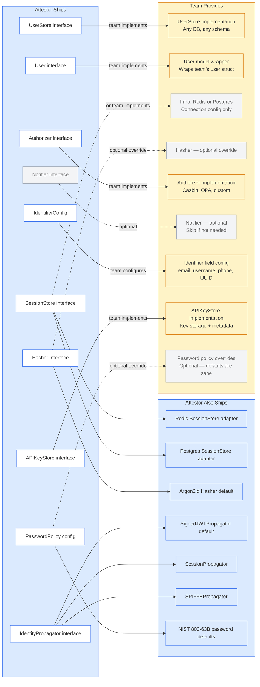

### Key Points

- **Interface count:** 8 interfaces total (UserStore, User, SessionStore, Hasher, Authorizer, Notifier, APIKeyStore, IdentityPropagator). Only 2 are required (UserStore, User). This is minimal for an enterprise auth library.
- **SessionStore**: unlike other interfaces, we ship two adapters (Redis, Postgres). The team provides the infrastructure, not the implementation. A custom adapter is the exception, not the norm.
- **APIKeyStore**: separate from UserStore. API keys have their own lifecycle (create, revoke, list) and metadata (scopes, expiry, last used). Shoehorning them into UserStore would pollute a clean interface.
- **IdentityPropagator**: three shipped implementations cover the full deployment spectrum. `SignedJWTPropagator` is the default. Custom implementations are possible for uncommon infrastructure.
- **PasswordPolicy**: a config struct, not an interface. NIST 800-63B defaults are sane; override only if you have domain-specific requirements.
- **Notifier**: grayed out because it's optional. Exception: if magic link mode is enabled, Notifier becomes required (validated at startup).
- **IdentifierConfig**: not an interface — it's configuration. The team tells us what field identifies a user.

---

## 9. C4 Level 4 — Code Diagrams (UML)

These diagrams zoom into the interfaces, structs, and their relationships at the code level. This is the C4 "Code" layer — UML class diagrams showing how interfaces connect to implementations.

### 9.1 Session Store — Interfaces and Adapters

The session subsystem is library-owned. We define the interface, the session struct, the config, and ship two adapters.

```mermaid
classDiagram
    direction TB

    namespace AuthLibrary {
        class SessionStore {
            <<interface>>
            +Create(ctx, session) error
            +Get(ctx, sessionID) Session, error
            +Update(ctx, session) error
            +Delete(ctx, sessionID) error
            +DeleteBySubject(ctx, subjectID) error
            +CountBySubject(ctx, subjectID) int, error
        }

        class SessionManager {
            -store SessionStore
            -config SessionConfig
            +CreateSession(ctx, subjectID) Session, error
            +ValidateSession(ctx, sessionID) Session, error
            +RefreshSession(ctx, sessionID) Session, error
            +DestroySession(ctx, sessionID) error
            +DestroyAllSessions(ctx, subjectID) error
        }

        class RedisSessionStore {
            -client redis.Client
            -prefix string
            -ttl time.Duration
            +Create(ctx, session) error
            +Get(ctx, sessionID) Session, error
            +Update(ctx, session) error
            +Delete(ctx, sessionID) error
            +DeleteBySubject(ctx, subjectID) error
            +CountBySubject(ctx, subjectID) int, error
        }

        class PostgresSessionStore {
            -db sql.DB
            -tableName string
            +Create(ctx, session) error
            +Get(ctx, sessionID) Session, error
            +Update(ctx, session) error
            +Delete(ctx, sessionID) error
            +DeleteBySubject(ctx, subjectID) error
            +CountBySubject(ctx, subjectID) int, error
        }

        class Session {
            +ID string
            +SubjectID string
            +CreatedAt time.Time
            +ExpiresAt time.Time
            +LastActiveAt time.Time
            +SchemaVersion int
            +Metadata map~string, any~
        }

        class SessionConfig {
            +IdleTimeout time.Duration
            +AbsoluteTimeout time.Duration
            +MaxConcurrent int
            +CookieName string
            +CookieDomain string
            +CookieSecure bool
            +CookieSameSite string
        }
    }

    SessionManager --> SessionStore : uses
    SessionManager --> Session : manages
    SessionManager --> SessionConfig : configured by
    RedisSessionStore ..|> SessionStore : implements
    PostgresSessionStore ..|> SessionStore : implements

    note for SessionStore "Team can implement this interface\nfor a custom session store\nif Redis/Postgres don't fit"
    note for SessionManager "Invariant: CreateSession always\ndestroys existing session first\n(session fixation prevention)"
    note for Session "SchemaVersion checked on startup.\nMismatch = fail with migration link."
```

**Reading this diagram:**
- `SessionStore` is the `<<interface>>`. We ship two implementations: `RedisSessionStore` and `PostgresSessionStore`.
- `SessionManager` is the orchestrator — it uses the store, enforces timeouts, manages concurrent sessions, and prevents session fixation.
- The dotted arrow (`..|>`) means "implements". Both adapters implement the `SessionStore` interface.
- The solid arrow (`-->`) means "uses" or "depends on".
- `Session.SchemaVersion` enables safe migrations — the library checks this on startup and fails clearly if outdated.
- Teams can add a third implementation if Redis/Postgres don't fit.

---

### 9.2 User Store, Authorizer, Notifier, Hasher — Interfaces and Types

These are the interfaces the team implements. We define the contracts; they fill in the logic.

```mermaid
classDiagram
    direction TB

    namespace AuthLibrary {
        class UserStore {
            <<interface>>
            +FindByIdentifier(ctx, identifier) User, error
            +Create(ctx, user) error
            +UpdatePassword(ctx, subjectID, hash) error
            +IncrementFailedAttempts(ctx, subjectID) error
            +ResetFailedAttempts(ctx, subjectID) error
            +SetLocked(ctx, subjectID, locked) error
        }

        class User {
            <<interface>>
            +GetSubjectID() string
            +GetIdentifier() string
            +GetPasswordHash() string
            +GetFailedAttempts() int
            +IsLocked() bool
            +IsMFAEnabled() bool
            +GetMetadata() map~string, any~
        }

        class IdentifierConfig {
            +Field string
            +CaseSensitive bool
            +Normalize func~string~ string
        }

        class Authorizer {
            <<interface>>
            +CanAccess(ctx, subject, action, resource) bool, error
        }

        class Notifier {
            <<interface>>
            +Notify(ctx, event, payload) error
        }

        class Hasher {
            <<interface>>
            +Hash(password) string, error
            +Verify(password, hash) bool, error
        }

        class Argon2idHasher {
            -timeCost uint32
            -memoryCost uint32
            -parallelism uint8
            +Hash(password) string, error
            +Verify(password, hash) bool, error
        }

        class AuthEvent {
            <<enumeration>>
            EventRegistration
            EventLogin
            EventLoginFailed
            EventLogout
            EventPasswordReset
            EventMagicLinkSent
            EventAccountLocked
        }

        class Identity {
            +SubjectID string
            +AuthMethod string
            +AuthTime time.Time
            +SessionID string
            +WorkloadID string
            +TrustDomain string
            +Metadata map~string, any~
        }
    }

    Argon2idHasher ..|> Hasher : implements
    Notifier --> AuthEvent : receives

    note for UserStore "Team implements this for\ntheir user schema and database"
    note for User "Team implements this interface\nto wrap their own user model"
    note for Authorizer "Team implements with\nCasbin, OPA, Cedar, or custom"
    note for Notifier "Optional: team implements\nonly if notifications needed"
```

**Key design decisions:**
- `User` is an **interface**, not a struct. The team wraps their own user model to satisfy it. We never dictate the user schema.
- `IdentifierConfig` is a struct with a `Normalize` function — e.g., lowercase for emails, trim for usernames.
- `Argon2idHasher` is the default `Hasher` we ship. Teams override only for legacy password schemes.
- `AuthEvent` is an enumeration. The `Notifier` receives these events. The `HookManager` also emits them.
- `Identity` is what goes into `context.Context`. It has no hardcoded `Email` or `Roles` — those go in `Metadata`.

---

### 9.3 API Key Store and Password Policy

API keys are a first-class concept, separate from user records. Password policy is a configurable struct with NIST 800-63B defaults.

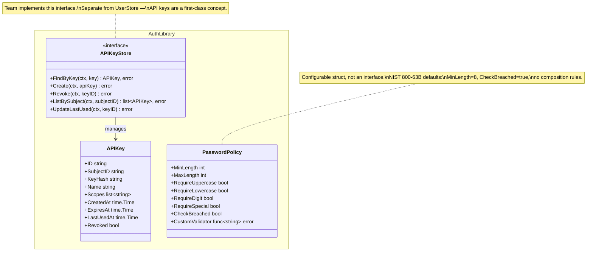

**Key design decisions:**
- `APIKeyStore` is separate from `UserStore`. API keys have their own lifecycle (create, revoke, list) and metadata (scopes, expiry, last used). A user may have multiple API keys. Shoehorning this into `UserStore` would pollute a clean interface.
- `APIKey.KeyHash` — we store hashes, not raw keys. The raw key is returned only on creation.
- `PasswordPolicy` is a struct, not an interface. It's configuration, not behavior. Teams override fields; they don't need to implement methods.
- **NIST 800-63B defaults** means no composition rules by default. The `RequireUppercase`, `RequireDigit`, etc. fields exist for teams with legacy compliance requirements, but they are `false` by default because NIST explicitly discourages them.

---

### 9.4 Identity Propagator — Interfaces and Implementations

The `IdentityPropagator` interface controls how user identity travels between services. Three implementations cover the full deployment spectrum.

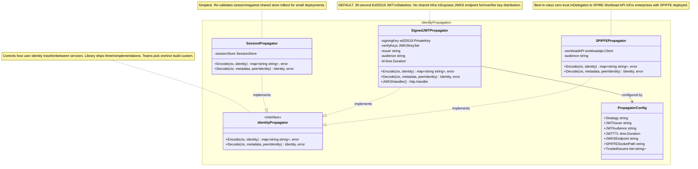

**Key design decisions:**
- `IdentityPropagator` has only two methods (`Encode` / `Decode`). Minimal surface. Easy to implement custom propagators.
- `SignedJWTPropagator` exposes `JWKSHandler()` — an HTTP handler that serves the public verification key in JWKS format. Verifying services add this to their trusted issuers config.
- `SPIFFEPropagator` never touches keys directly. All signing and verification is delegated to the SPIRE Workload API. The library is just a consumer.
- `Decode` receives `peerIdentity *WorkloadIdentity` — the mTLS peer identity is always available alongside the propagated user identity.

---

### 9.5 Auth Engine, Modes, and Protocol Bindings

The engine dispatches to auth modes. Protocol bindings are thin adapters that extract credentials and feed them to the engine.

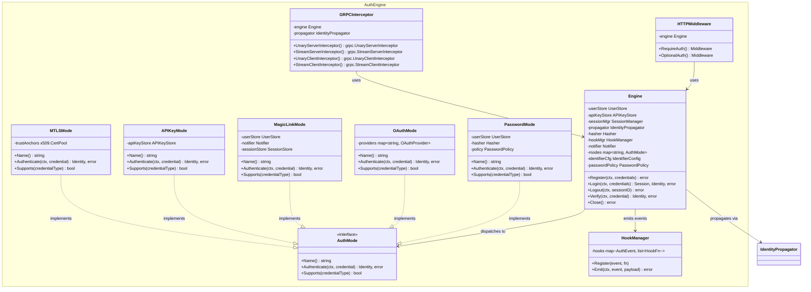

**Key patterns:**
- `AuthMode` is the **strategy pattern**. Each mode implements the same interface. The engine dispatches based on `Supports(credentialType)`.
- `APIKeyMode` depends on `APIKeyStore` (not `UserStore`). API keys are a separate domain.
- `MagicLinkMode` depends on `Notifier` — this is why Notifier becomes required when magic link mode is enabled.
- `MagicLinkMode` depends on `MagicLinkStore` — magic link tokens are stored using the same session store infrastructure. An optional `MagicLinkStore` interface is exposed for custom storage.
- `PasswordMode` holds a `PasswordPolicy` reference — validates passwords on registration and change.
- `Engine` holds an `IdentityPropagator` — used by `GRPCInterceptor` for cross-service identity propagation.
- `HTTPMiddleware` and `GRPCInterceptor` are thin wrappers around `Engine`. They extract credentials from protocol-specific locations and feed them into `Engine.Verify()`.
- `HookManager` lets teams register callbacks for lifecycle events without modifying any auth code.

---

## 10. Sequence Diagrams

### 10.1 HTTP Request — Session Validation

The most common flow. Session cookie → validate session via library-owned session store → identity in context → business logic.

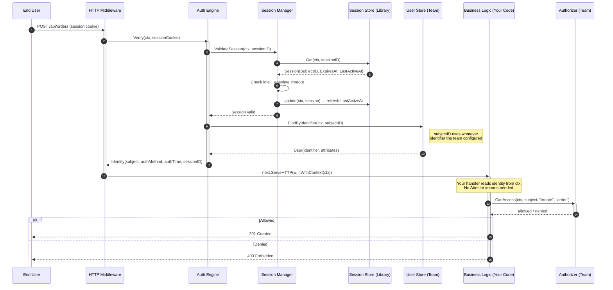

---

### 10.2 Password Login — With Security Protections

Shows the Password auth mode dispatching, constant-time dummy hash, account lockout, session fixation prevention, and session creation via library-owned session store.

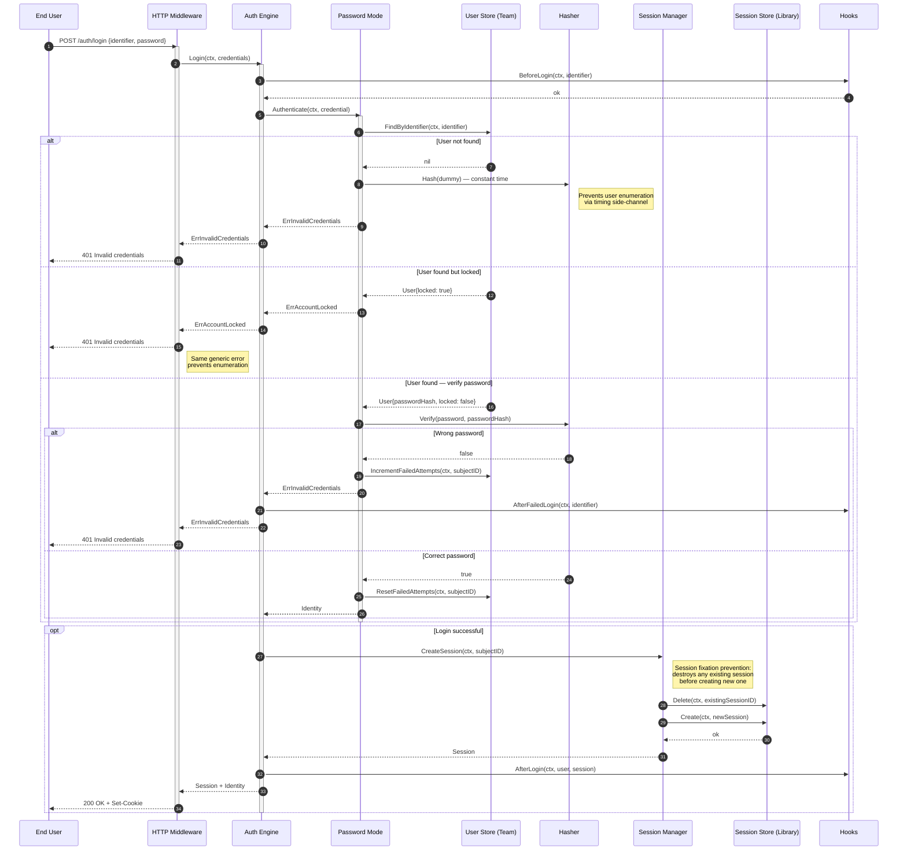

**Security protections (that ARE our concern):**
- Constant-time dummy hash when user doesn't exist (timing attack prevention)
- Generic error messages for all failure paths (user enumeration prevention)
- Account lockout after N failed attempts (brute-force protection at the auth level)
- Session fixation prevention — old session destroyed, new session ID generated

**What is NOT our concern:**
- Rate limiting — infrastructure layer (API gateway, reverse proxy)

---

### 10.3 OAuth2 / OIDC Login — With Auto-Registration

Shows the full OAuth flow with PKCE. Key feature: **auto-registration on first login** for seamless user onboarding.

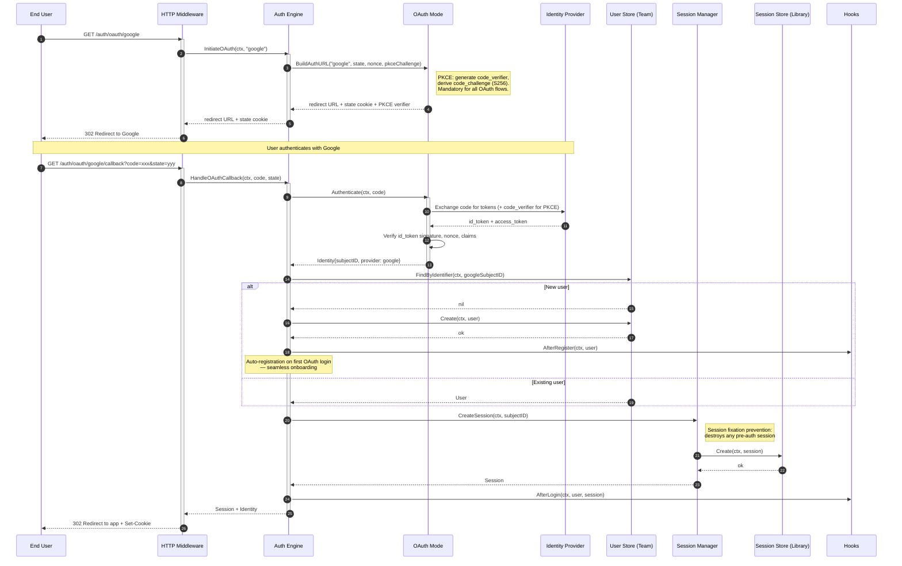

**Onboarding:** First-time OAuth users are automatically registered. No separate registration step. The `AfterRegister` hook fires so teams can run onboarding logic (create default settings, send welcome notification via Notifier, etc.).

---

### 10.4 Magic Link — Passwordless Login

Shows the magic link flow. The `Notifier` is **required** for this mode — validated at startup. Magic link tokens are stored using the session store infrastructure.

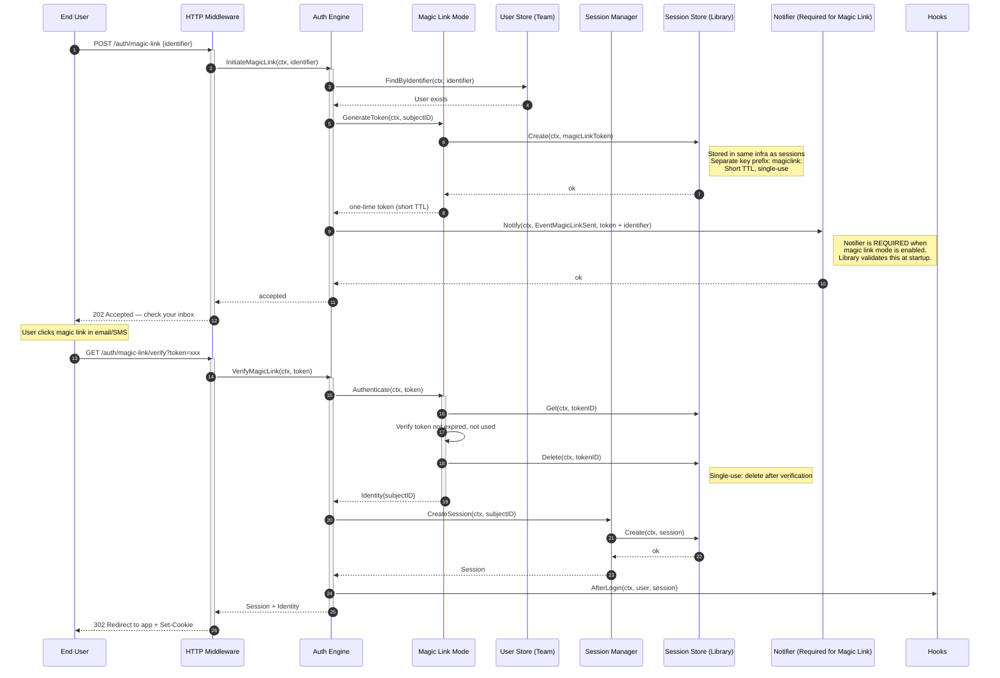

---

### 10.5 User Registration — With Onboarding

Registration creates the user AND immediately creates a session — the user is logged in from the moment they register. No redirect to a login page. Password is validated against the configured `PasswordPolicy`.

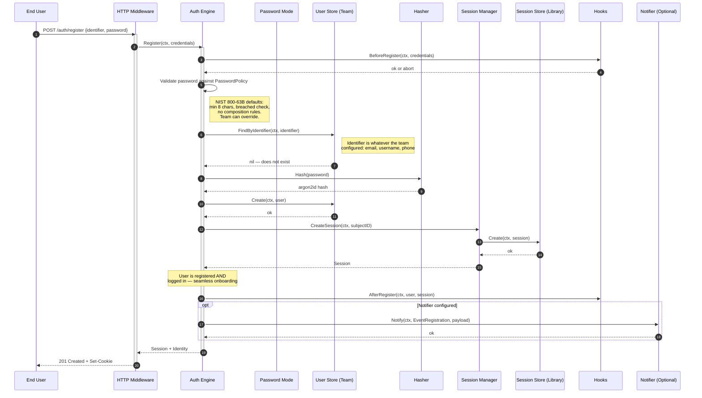

**Onboarding experience:**
- User registers → password validated → session is created immediately → user is logged in.
- No "please check your email and then login" friction.
- `AfterRegister` hook fires with the session — teams can run onboarding logic (create default workspace, preferences, etc.).
- If Notifier is configured, a welcome notification is sent. If not, silently skipped.

---

### 10.6 Cross-Protocol — HTTP to gRPC Identity Propagation

Identity propagates automatically when an HTTP handler makes a gRPC call to a downstream service. The `IdentityPropagator` controls how identity is encoded and verified.

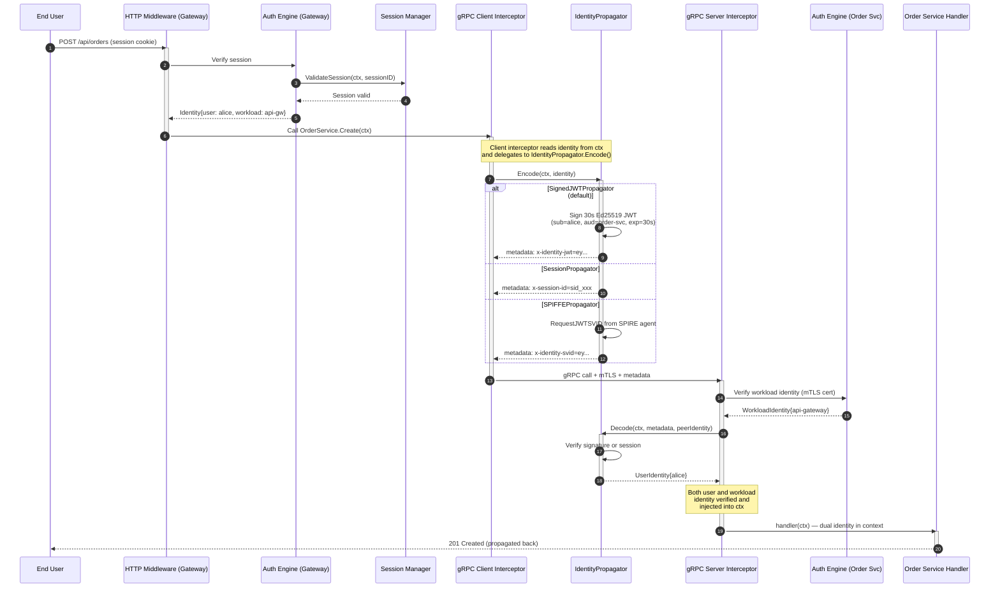

**Key points:**
- The `IdentityPropagator` is pluggable. The sequence diagram shows all three implementations in an `alt` block.
- **`SignedJWTPropagator` (default):** Creates a 30-second Ed25519 JWT. Stateless verification. Works across clusters, regions, and event-driven architectures.
- **`SessionPropagator`:** Forwards the session ID. Service B re-validates against the shared session store. Simplest, but requires shared infrastructure.
- **`SPIFFEPropagator`:** Requests a JWT-SVID from the local SPIRE agent. Best-in-class zero-trust, but requires SPIFFE/SPIRE infrastructure.
- Zero developer code. The client interceptor calls `Encode()` automatically; the server interceptor calls `Decode()` automatically.

---

### 10.7 System-to-System — Machine Identity Only

A cron job or background worker authenticating as a workload. No user involved.

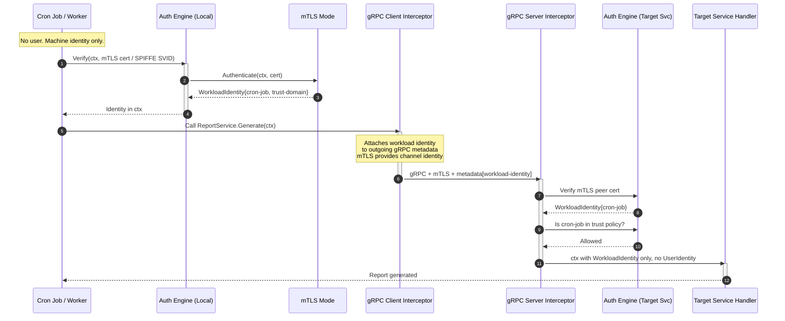

---

## 11. Identity Context

### 11.1 What It Contains

The `Identity` struct in `context.Context` is the only contract between the Attestor and your code:

| Field | Type | Description |
|---|---|---|
| **SubjectID** | `string` | The user identifier (whatever the team configured). Empty for system-to-system. |
| **AuthMethod** | `string` | How identity was established: `"password"`, `"oauth2"`, `"magic_link"`, `"api_key"`, `"mtls"`, `"spiffe"` |
| **AuthTime** | `time.Time` | When authentication occurred |
| **SessionID** | `string` | Current session ID. Empty for stateless/S2S auth. |
| **WorkloadID** | `string` | SPIFFE ID or service name. Empty for direct user requests. |
| **TrustDomain** | `string` | Workload trust domain (e.g., `acme.com`) |
| **Metadata** | `map[string]any` | Extensible. Teams attach custom claims via hooks. |

**Note:** No hardcoded `Email`, `Roles`, or `Name`. SubjectID is whatever the team configured. Additional attributes go in `Metadata`.

### 11.2 Accessing It

```
identity := auth.GetIdentity(ctx)
```

Returns the identity or nil for unauthenticated requests. This is the **only** import your code needs.

### 11.3 Dual Identity

When Service A calls Service B on behalf of User X, context carries both:

| Identity | Source |
|---|---|
| **User Identity** | Propagated via `IdentityPropagator` from the original request |
| **Workload Identity** | mTLS peer certificate of the calling service |

This is necessary for zero-trust: a gRPC request in production carries both "who is the human" and "which service is calling". Without this, you can't do proper audit or authorization.

---

## 12. Integration Summary

### What the Team Provides

| Requirement | Effort |
|---|---|
| `UserStore` implementation | Implement 6 methods for your user model |
| `User` interface wrapper | Wrap your user struct (7 getter methods) |
| `IdentifierConfig` | One config value: what field is the user identifier |
| Redis or Postgres connection | Connection string for session store |
| `APIKeyStore` implementation | 4 methods — only if API key mode is used |
| `Authorizer` implementation | 10–30 lines wrapping your policy engine (if AuthZ needed) |
| `Notifier` implementation | Only if you want auth event notifications (or use magic link) |

### What the Team Writes in Business Logic

Nothing from the Attestor. Just:

```
identity := auth.GetIdentity(ctx)
```

Zero other auth imports. No session validation. No credential extraction. No password hashing. The interceptors handled everything before your code runs.

---

## 13. Design Rationale

Key architectural decisions and why they are correct. This section captures the reasoning behind non-obvious choices to prevent future re-litigation.

### Protocol-Level OIDC, Not Provider SDKs

We depend on `/.well-known/openid-configuration` and JWKS — the OIDC spec. Zero provider-specific code. Okta, Entra ID, PingOne, Keycloak, Auth0, ForgeRock, Cognito — they all implement this. If a new IdP appears tomorrow, it works if it's OIDC-compliant. This is the right abstraction.

### Library as Interceptor, Not Framework

Middleware/interceptor pattern means zero coupling to business logic. Teams import one function (`auth.GetIdentity(ctx)`). No framework lock-in. Can be removed in a day.

### Identity Normalization via `context.Context`

All auth modes produce the same `Identity`. Business logic is completely decoupled from how authentication happened. This is fundamental and correct.

### `UserStore` as Interface, Not Schema

We never dictate user schema. We never own migrations for user tables. The interface is minimal (6 methods). Teams keep full ownership of their data model.

### Hooks Instead of Inheritance

`HookManager` with typed callbacks avoids the template method antipattern. Teams add behavior without subclassing. Composable and testable.

### Interface Count Is Minimal

8 interfaces total (UserStore, User, SessionStore, Hasher, Authorizer, Notifier, APIKeyStore, IdentityPropagator). Only 2 are required (UserStore, User). The rest have defaults, shipped implementations, or are optional. This is minimal for an enterprise auth library.

### Redis/Postgres Only for Session Adapters

Two adapters cover >90% of deployments. The `SessionStore` interface exists for the rest. We're not a database driver library.

### No Rate Limiting

Rate limiting is an infrastructure concern. Mixing it into an auth library creates configuration conflicts with API gateways. Correct scope exclusion.

### Internal Assertions ≠ Token Issuance

The `SignedJWTPropagator` creates 30-second internal assertions for cross-service identity propagation. These are infrastructure plumbing — not access tokens for team APIs or end users. The principle "we don't issue tokens" applies to external-facing tokens.

### No SAML

SAML is a legacy protocol. Every enterprise IdP that speaks SAML also speaks OIDC. Supporting SAML would triple our protocol surface for <5% of use cases. For the rare SAML-only case, a SAML-to-OIDC bridge (Dex, Keycloak) is the correct approach.

---

*Architecture v1.0 — 2026-02-17*
